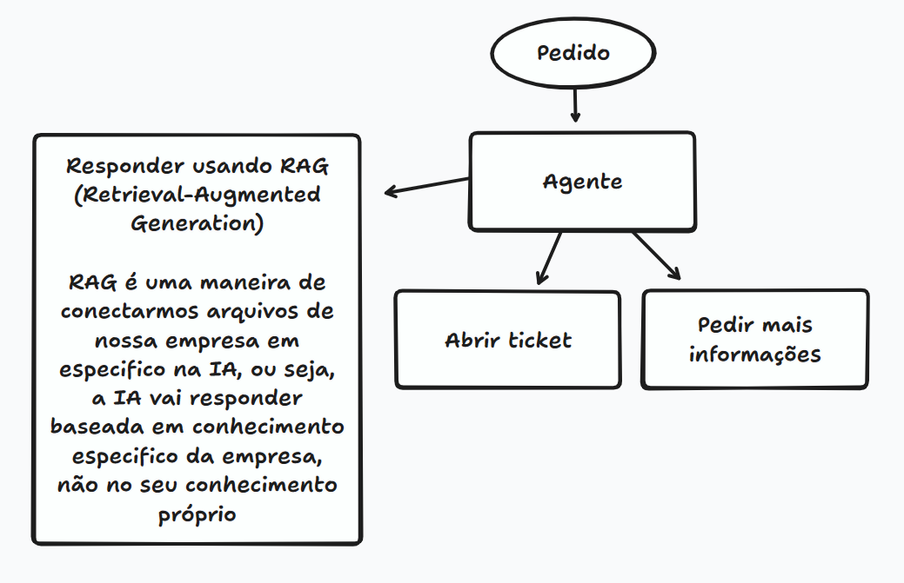

## Masterclass: Uma visão geral sobre Agentes de IA

#### Links:

- [Primeiros passos em Inteligência Artificial.](https://www.alura.com.br/artigos/primeiros-passos-em-inteligencia-artificial-ia)
- [Acesse o Guia de Mergulho](https://alura.tv/guiademergulhoAgentesdeIA)

## Masterclass Intermediária de Python

#### Links:

- [Site de apoio](https://guilhermeonrails.github.io/materclass-python-ia-agentes/)
- [Repo do Git com o material de apoio](https://github.com/guilhermeonrails/materclass-python-ia-agentes)
- [Colab da materclass](https://colab.research.google.com/drive/1oWdfajl9clgrAuoMfJ3ErrPLXHFCSjvu?usp=sharing)
- [PDF com resumo da masterclass](https://fiapcom.sharepoint.com/:b:/s/Alura/EfqhCAwXtPREos7vOsJ4q_YBwfIUT3kJFDP9p82q1ekp7g?e=AYGTv2)

## Aula 01: Classificação de intenções com IA 

## 🔑 Conceitos para revisar: 

1. **Prompt Engineering (Engenharia de Prompts)**

   * Como escrever instruções claras para a IA.
   * Como restringir a saída (ex: só JSON, sem explicações).
   * Diferença entre *System Prompt* (regras fixas) e *Human Prompt* (mensagem do usuário).

2. **Estruturar Saídas**

   * Uso de **Pydantic** para garantir que a resposta seja bem formatada.
   * Trabalhar com **schemas JSON** (bem comum em APIs).

3. **LangChain / Frameworks de orquestração**

   * Encadear prompts e chamadas de IA.
   * Usar “chains” e “agents”.
   * Trabalhar com **memória** (IA lembrar de mensagens anteriores).

4. **Casos reais de uso**

   * Triagem de chamados.
   * Atendimento ao cliente.
   * Suporte técnico.
   * Roteamento de perguntas para áreas certas (RH, TI, Financeiro).

#### Links:

- [Link do projeto](https://colab.research.google.com/drive/1NiBLK4-FUC6D_B8V5CN6bUXPnCC11wmz?usp=sharing)
- [Acesse o Google Gemini aqui](https://goo.gle/alura-gemini-br)
- [Acesse o Google AI Studio aqui](https://goo.gle/alura-aistudio-br)
- [Pegar a API Key no Google AI Studio](http://goo.gle/alura-apikey)

#### Códigos feitos por mim: 

- [Código da Aula 01 (.ipynb)](aula_1_imersão_agentes_ia_alura.py)
- [Código de prática da Aula 01](Self-taught/triagem_helpdesk.py)

#### Fluxo: 

## Aula 02: Construindo a base de conhecimento com RAG

#### Links:

## Aula 03: Orquestração do agente com LangGraph

#### Links:
