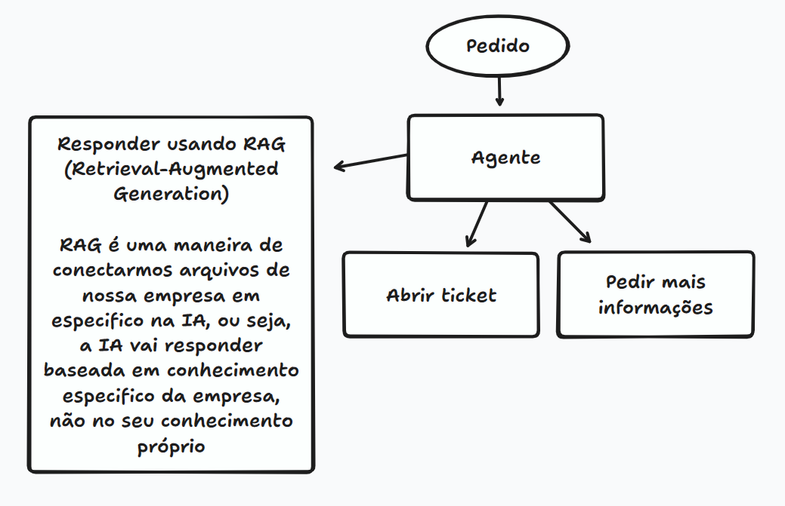

# Masterclass: Uma visão geral sobre Agentes de IA

#### Links:

- [Primeiros passos em Inteligência Artificial.](https://www.alura.com.br/artigos/primeiros-passos-em-inteligencia-artificial-ia)
- [Acesse o Guia de Mergulho](https://alura.tv/guiademergulhoAgentesdeIA)

# Masterclass Intermediária de Python

#### Links:

- [Site de apoio](https://guilhermeonrails.github.io/materclass-python-ia-agentes/)
- [Repo do Git com o material de apoio](https://github.com/guilhermeonrails/materclass-python-ia-agentes)
- [Colab da materclass](https://colab.research.google.com/drive/1oWdfajl9clgrAuoMfJ3ErrPLXHFCSjvu?usp=sharing)
- [PDF com resumo da masterclass](https://fiapcom.sharepoint.com/:b:/s/Alura/EfqhCAwXtPREos7vOsJ4q_YBwfIUT3kJFDP9p82q1ekp7g?e=AYGTv2)

# Aula 01: Classificação de intenções com IA 
- Key: ?

## 🔑 Conceitos para revisar: 

1. **Prompt Engineering (Engenharia de Prompts)**

   * Como escrever instruções claras para a IA.
   * Como restringir a saída (ex: só JSON, sem explicações).
   * Diferença entre *System Prompt* (regras fixas) e *Human Prompt* (mensagem do usuário).

2. **Estruturar Saídas**

   * Uso de **Pydantic** para garantir que a resposta seja bem formatada.
   * Trabalhar com **schemas JSON** (bem comum em APIs).

3. **LangChain / Frameworks de orquestração**

   * Encadear prompts e chamadas de IA.
   * Usar “chains” e “agents”.
   * Trabalhar com **memória** (IA lembrar de mensagens anteriores).

4. **Casos reais de uso**

   * Triagem de chamados.
   * Atendimento ao cliente.
   * Suporte técnico.
   * Roteamento de perguntas para áreas certas (RH, TI, Financeiro).

#### Links:

- [Link do projeto](https://colab.research.google.com/drive/1NiBLK4-FUC6D_B8V5CN6bUXPnCC11wmz?usp=sharing)
- [Acesse o Google Gemini aqui](https://goo.gle/alura-gemini-br)
- [Acesse o Google AI Studio aqui](https://goo.gle/alura-aistudio-br)
- [Pegar a API Key no Google AI Studio](http://goo.gle/alura-apikey)

#### Códigos feitos por mim: 

- [Código da Aula 01 (.ipynb)](aula_1_imersão_agentes_ia_alura.py)
- [Código de prática da Aula 01](Self-taught/triagem_helpdesk.py)

#### Fluxo: 

# Aula 02: Construindo a base de conhecimento com RAG 
- Key: CHUNKS

## 🔹 O que são *Embeddings*?

* Imagine que cada palavra, frase ou documento precisa ser transformado em **números** para que a máquina entenda.
* O *embedding* é justamente essa **tradução para números**: ele pega um texto e o transforma em uma lista de números chamada **vetor**.
* Esses números não são aleatórios: eles guardam o **significado** do texto.
  Exemplo: "carro" e "automóvel" vão virar vetores parecidos, porque significam quase a mesma coisa.

➡️ Ou seja: *embedding* = representação numérica (com significado) de um texto.

---

## 🔹 O que são *Vetores*?

* Vetor = a lista de números que o embedding gera.
  Exemplo simplificado:

  * "cachorro" → \[0.12, 0.98, 0.45, ...]
  * "gato" → \[0.11, 0.95, 0.47, ...]
* Como os vetores ficam em um **espaço matemático**, dá para medir a **distância** entre eles.

  * Quanto menor a distância → mais parecidos os textos.
  * Exemplo: "cachorro" está mais perto de "gato" do que de "avião".

---

## 🔹 Onde entra isso em IA / LangChain / RAG?

1. **RAG (Retrieval-Augmented Generation)**

   * Você faz uma pergunta → ela vira embedding (vetor).
   * O sistema compara esse vetor com os vetores do banco de dados (textos já transformados em embedding).
   * Ele recupera os mais parecidos → passa para o modelo de IA → o modelo responde com base nesses textos.

2. **LangChain**

   * Ele é como um “orquestrador”: pega sua pergunta, gera embedding, busca os vetores parecidos, junta os textos e manda para o modelo de linguagem responder.
   * É muito usado para criar *chatbots com base em documentos*.

---

## 🔹 Analogia fácil

* Pense em um **GPS de significados**.

  * Cada palavra ou texto é um ponto no mapa (o vetor).
  * O embedding é o processo de colocar esse ponto no lugar certo no mapa.
  * Para buscar algo, você procura os pontos mais próximos do seu.

Exemplo prático:
Você pergunta: *"O que é IA?"*

* O sistema cria o vetor da sua pergunta.
* Ele procura os textos mais próximos no mapa (por exemplo, artigos que falam de "Inteligência Artificial").
* Depois junta e devolve a resposta.

#### Links:

- [Link do projeto](https://colab.research.google.com/drive/1nErQMVPdPlp6HOUnE4rLtHj30WQz-fDH?usp=sharing)
- [Acesse o Google Gemini aqui](https://goo.gle/alura-gemini-br)
- [Acesse o Google AI Studio aqui](https://goo.gle/alura-aistudio-br)
- [Pegar a API Key no Google AI Studio](http://goo.gle/alura-apikey)
- [Baixar PDFs usados na aula](https://fiapcom.sharepoint.com/:f:/s/Alura/EgXUUcDoHDBBosouJgEJfHYBBWuR109bX7XbPfACYk8TUg?e=kqUpj5)

# Aula 03: Orquestração do agente com LangGraph

#### Links:
